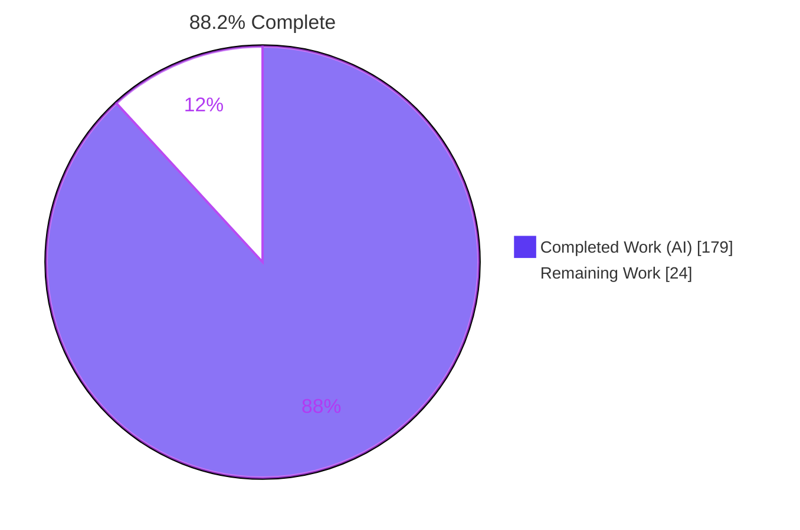
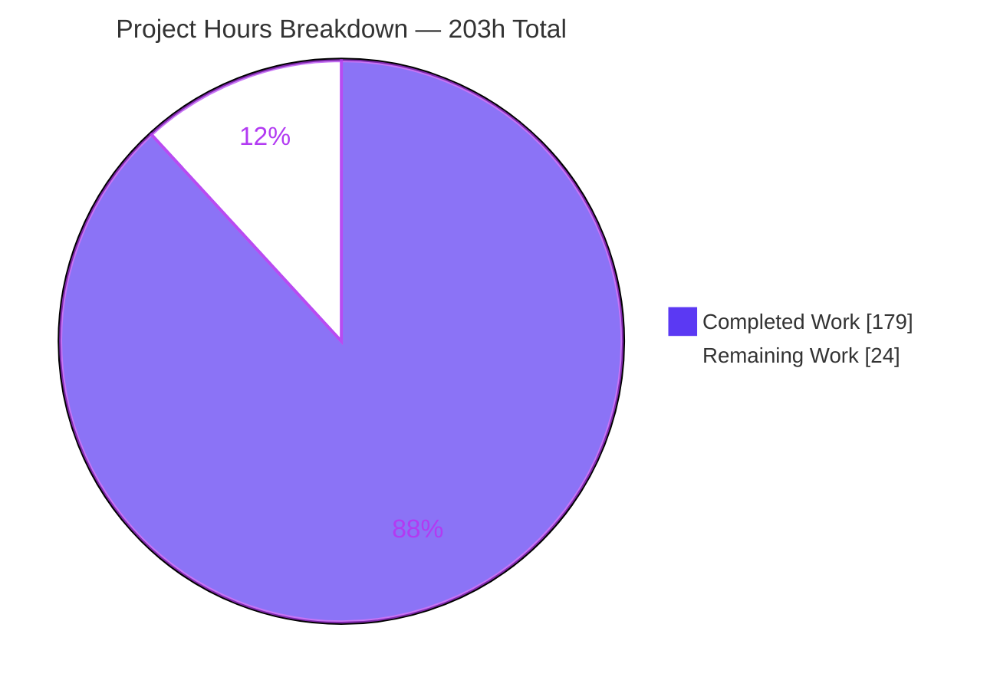
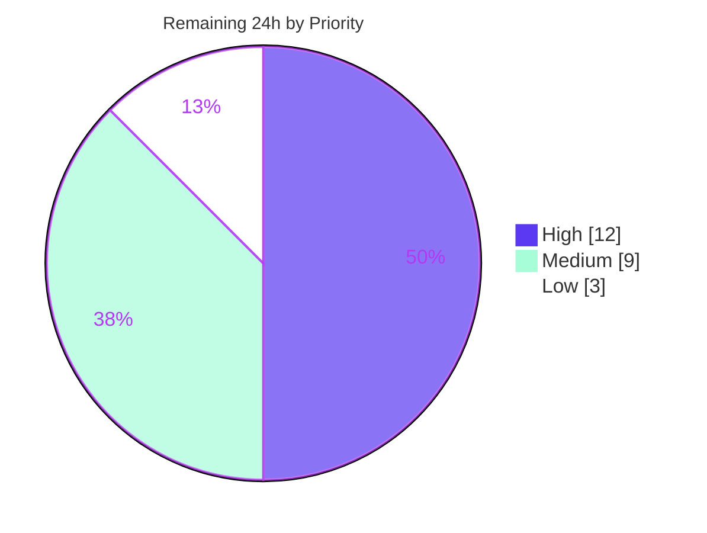

# Blitzy Project Guide

**Project:** `monty` — two-argument `iter(callable, sentinel)`
**Repository:** `monty` (Cargo workspace v0.0.12, edition 2024, MSRV 1.90, 9 crates)
**Branch:** `blitzy-8ca55a8f-a82d-4505-84b0-98b048bfaf1e` · **HEAD:** `aac41a7` · **Base:** `0de14b4` · **28 commits**
**Change set:** 5 files, +1,706 / −87 (net +1,619 lines)

---

## 1. Executive Summary

### 1.1 Project Overview

`monty` is a sandboxed Python interpreter written in Rust and embedded by Rust, Python and JavaScript hosts. This project implements the two-argument form of the `iter()` builtin — `iter(callable, sentinel)` — which monty previously rejected with `TypeError: iter(callable, sentinel) is not yet supported`. The sentinel form is the canonical "call this until it returns X" idiom (`for line in iter(read_line, '')`), so its absence broke a common class of Python program and every consumer relying on monty to match CPython. The work delivers CPython 3.14.6-identical semantics — lazy invocation, value-equality stopping, self-iterability, exception transparency — plus the iterator infrastructure and sandbox hardening needed to make the idiom usable and safe.

### 1.2 Completion Status



<sub>Legend — **Completed / AI Work:** Dark Blue `#5B39F3` · **Remaining / Not Completed:** White `#FFFFFF`</sub>

| Metric | Value |
|---|---|
| **Total Hours** | **203.0 h** |
| **Completed Hours (AI + Manual)** | **179.0 h** (AI 179.0 h + Manual 0.0 h) |
| **Remaining Hours** | **24.0 h** |
| **Percent Complete** | **88.2 %** |

**Calculation (PA1, AAP-scoped only):**

```
Completion % = Completed Hours / (Completed Hours + Remaining Hours) x 100
             = 179.0 / (179.0 + 24.0) x 100
             = 179.0 / 203.0 x 100
             = 88.2 %
```

The hours universe is exactly (a) every deliverable declared in the Agent Action Plan — requirements R1–R7, implicit requirements I1–I15, the §0.6.1 four-group execution plan, and the §0.8 validation and quality gates — plus (b) the standard path-to-production activities required to ship those deliverables. Twelve known pre-existing divergences (AAP §0.7.2 D1–D12, the typeshed `iter` gap, the NaN-sentinel comparison gap, and the gated `heap.rs` garbage-collector refactor) are **explicitly excluded from the denominator** and carry 0 hours, because the AAP freezes them as out of scope.

### 1.3 Key Accomplishments

- ✅ **Feature complete and CPython-exact.** All seven explicit AAP requirements (R1 sentinel semantics, R2 self-iterability, R3 exception transparency, R4 arity, R5 arity-error preservation, R6 `==`-by-value stopping, R7 laziness) are implemented and proven byte-identical to CPython 3.14.6.
- ✅ **All fifteen implicit requirements (I1–I15) satisfied**, including the blocking `GetIter` prerequisite (I1) that makes `for v in iter(read, 0):` usable at all, the two-value garbage-collection traversal solved with a pair tuple and **zero `heap.rs` edits** (I2/I2a), sticky exhaustion (I8), and the exception-does-not-exhaust rule (I9).
- ✅ **Zero test failures across every repository gate** — 1,544 / 1,528 / 1,546 in the three feature configurations, 932 differential fixture runs, 21 type-checking, 31 Miri, 5 compile-fail, 907 pytest, 340 JavaScript.
- ✅ **466 differential fixtures execute twice each** (once under monty, once under embedded CPython 3.14.6) with 0 failures — including the two new fixtures: a 758-line / 124-assert conformance suite spanning 15 scenario sections, and a 121-line reference-count ownership fixture.
- ✅ **A guest-triggered host-abort class of sandbox defect was found and closed.** At the base commit, ordinary guest code could kill the host process two ways (`panicked at vm/mod.rs:1900` and `panicked at heap.rs:949`). Both are now clean, catchable interpreter errors. This is a **net security improvement over base**.
- ✅ **Memory safety proven, not asserted.** Miri reports zero undefined behaviour in all three feature configurations; both reference-count enforcement gates were proven *live* by deliberate negative perturbation and then restored byte-identically; `size_of::<MontyIter>()` is unchanged (`IterValue` 40 B, `MontyIter` 64 B at both HEAD and a pristine base worktree).
- ✅ **Runtime validated on every surface** — CLI (script, `-c`, `-i` REPL, `-t`, three resource-limit flags), the Python (PyO3) binding, the JavaScript (napi) binding, and a real headless-Chrome 13-scenario harness with 13/13 scenario matches, zero console messages and 30/30 HTTP 200.
- ✅ **Zero forbidden files touched.** `heap.rs`, `args.rs`, `exception_private.rs`, `op.rs`, `type.rs`, `tuple.rs`, `value.rs`, `heap_data.rs`, all `Cargo.toml` manifests, `Cargo.lock`, `uv.lock` and `package-lock.json` are all 0-changed — independently verified in this session.
- ✅ **Lint, format and documentation clean** on the active toolchain — `make lint-rs` exit 0 with zero warnings under `-D warnings`, `cargo +nightly fmt --all -- --check` zero drift, ruff/basedpyright/stubtest all clean, 10 README examples plus 3 doc-tests passing.

### 1.4 Critical Unresolved Issues

No issue blocks the *functionality* of the delivered feature. The four items below block the **merge and CI-green milestone** and each requires a human decision or a change on `main` that is outside this branch's AAP scope.

| Issue | Impact | Owner | ETA |
|---|---|---|---|
| **`prepare.rs` is a fifth changed file, outside the AAP §0.7.1 four-file scope.** Reverting it makes the in-scope conformance fixture fail (`RuntimeError: Internal error in monty: LoadCell: entry is not a Cell`); at the pristine base the same latent bug **aborts the host** (`panicked at vm/mod.rs:1900`, exit 101) for ordinary guest code. No in-scope workaround exists — the cell-var decision is made at compile time. | Blocks AAP §0.8.2 / §0.8.6 literal sign-off. Recommended resolution: split into a standalone bug-fix PR merged first. | Tech lead / AAP owner | 3.0 h |
| **CI `lint` job will fail on `yamlfmt`.** `.github/workflows/ci.yml:36-39` runs `uvx pre-commit run --all-files` with `fail_fast: true`, and yamlfmt v0.21.0 is ordered before the Rust hooks. It rewrites `catalog-info.yaml` (md5 `d9de7795…` → `8630e3ec…`, exit 1). The file is **0-changed by this branch** — the defect was introduced by base commit `0de14b4` itself. | Red CI pipeline on the `lint` job. Not caused by, and not fixable within, this change set. | Repo maintainer (fix on `main`) | 1.0 h |
| **CI `lint` job runs the *nightly* toolchain, where clippy 0.1.99 reports 4 pre-existing `-D warnings` errors** — `exception_public.rs:53:37` and `:61:37` (redundant reference in `write!`), `modules/json/string_cache.rs:101:26` (`explicit_iter_loop`), `types/set.rs:218:38` (`drain_collect`). All four are in files this branch does not touch; the active default toolchain 1.96.1 is clean. | Red CI pipeline on the `lint` job. Blocks AAP §0.8.5 at CI parity. | Repo maintainer (fix on `main`) | 2.0 h |
| **Six untracked Chrome evidence artifacts under `blitzy/`**, a path absent from `.gitignore`. `git status --porcelain` reports `?? blitzy/`. | Dirty working tree at merge time; artifacts could be committed accidentally. | Release engineer | 1.0 h |

### 1.5 Access Issues

**No access issues identified.** Every credential, permission and network dependency required to build, test and validate this project was exercised successfully in this session.

| System / Resource | Type of Access | Issue Description | Resolution Status | Owner |
|---|---|---|---|---|
| Git repository (`blitzy-8ca55a8f-…` branch) | Read / write / commit | None — 28 commits authored and committed as `Blitzy Agent <agent@blitzy.com>`; working tree clean; `git diff HEAD` empty | ✅ No issue | — |
| crates.io registry | Dependency fetch | None — `cargo fetch --locked` succeeds against the committed `Cargo.lock` with zero drift | ✅ No issue | — |
| PyPI via `uv` | Dependency fetch | None — `uv sync --all-packages --only-dev --locked` succeeds; CPython 3.14.6 present in `.venv` | ✅ No issue | — |
| npm registry | Dependency fetch | None — `CI=true npm ci` succeeds for `crates/monty-js` | ✅ No issue | — |
| Rust toolchains | Local install | None — stable 1.96.1 active, nightly 1.99.0 available for `fmt` and `miri` | ✅ No issue | — |
| Headless Chrome | Local browser runtime | None — real headless Chrome drove the 13-scenario harness; 30/30 HTTP 200, zero console messages | ✅ No issue | — |
| Third-party APIs / cloud services / databases | — | Not applicable — `monty` is a self-contained interpreter with no database, no network service and no external API dependency | ✅ N/A | — |

### 1.6 Recommended Next Steps

1. **[High] Adjudicate the `prepare.rs` scope deviation (3.0 h).** Choose between accepting the fifth file, splitting it into a standalone bug-fix PR merged first (**recommended**), or reverting and redesigning (not viable — proven to break the in-scope fixture and to abort the host at base). Evidence is already recorded in the body of commit `aac41a7`.
2. **[High] Senior code review of the 5-file, +1,706-line interpreter-core change set (6.0 h).** Review in the order `types/iter.rs` → `bytecode/vm/mod.rs` → `prepare.rs` → both fixtures, focusing on pair-tuple ownership, the three borrow windows around VM re-entry, `slot_intact` pop-by-position logic, and `StopIteration`-as-exhaustion narrowing.
3. **[High] Green up CI on `main` (3.0 h combined).** Fix the 4 pre-existing nightly-clippy errors (2.0 h) and the `yamlfmt` failure on `catalog-info.yaml` (1.0 h). Neither is caused by this branch, but `fail_fast: true` means both must be resolved for the `lint` job to pass.
4. **[Medium] Rebase onto `main` and re-run the full gate matrix (3.0 h).** Expected counts after rebase: 1,544 / 1,528 / 1,546 / 932 / 21 / 31 / 907 / 340.
5. **[Medium] Decide the fate of the six untracked `blitzy/` evidence artifacts (1.0 h)** — commit them, move them to release artifact storage, or add `blitzy/` to `.gitignore`. Acceptance: `git status --porcelain` is empty.

---

## 2. Project Hours Breakdown

### 2.1 Completed Work Detail

Every row traces to a specific AAP deliverable group, an AAP requirement identifier, or a declared path-to-production activity. Line counts are from `git diff 0de14b4 --numstat`.

| Component | Hours | Description |
|---|---|---|
| **[AAP §0.6.2 Group 1] Callable-sentinel iterator core — `crates/monty/src/types/iter.rs`** | **40.0** | All six specified edits delivered (+482 / −19 into a 1,093-line file): rustdoc rewrite replacing the "Not yet supported" bullet; `CallableSentinel { pair: HeapId, done: bool }` **appended last** after `HeapRef` for postcard positional-discriminant compatibility (I7); the two-argument `init` branch with eager callability check → `ExcType::type_error("iter(v, w): v must be callable")` → `allocate_tuple(smallvec![callable, sentinel])` → `mark_potential_cycle()`, with full fallible-allocation recovery on **both** allocations; the private `is_callable` predicate mirroring `VM::call_function`; the `callable_sentinel_pair` / `callable_sentinel_step` helpers (`check_time` → `with_gc_paused` → `with_frame_state_restored` → `HeapGuard` → `evaluate_function(…, ArgValues::Empty)` → `py_eq`); and the `for_next`, `advance` and `size_hint` arms. Satisfies R1, R3, R4, R6, R7, I5, I6, I7, I8, I9, I10, I11, I12. |
| **[AAP §0.6.3 Group 2] VM iteration infrastructure — `crates/monty/src/bytecode/vm/mod.rs`** | **12.0** | The two AAP-specified edits: the `Opcode::GetIter` pass-through for an already-constructed iterator, which is the blocking prerequisite I1 without which `for v in iter(read, 0):` is unwritable, implemented refcount-neutrally because `GetIter` pops; and the `Opcode::ForIter` instruction-pointer synchronisation before `iter.advance(self)` with restoration afterwards, satisfying I4 so exception-handler lookup and position reporting survive a nested frame push. |
| **[AAP I2 / I3 / I12 hardening] Re-entrancy, GC-pause and sandbox safety in the dispatch loop** | **18.0** | Unforeseen safety work required to make VM re-entry from inside an iterator advance actually sound (+302 / −63 total for this file): the `ForIter` **pin guard** (`peek().clone_with_heap()` plus `stack_len`/`frame_depth` capture and `slot_intact` pop-by-position logic) — proven load-bearing, since removing it lets guest code under `--max-memory` abort the host at `heap.rs:949` with exit 101; `with_gc_paused` / `gc_pause_depth`; `with_frame_state_restored` and `discard_frames_above`; `StoreCell` routed through `try_catch_sync!`; and `panic!` → `RunError::internal` conversion in `load_cell`, `store_cell` and `cell_id_from_local`. Roughly 20 stale doc comments were corrected alongside. |
| **[Scope deviation] Closure cell-variable capture in statement headers — `crates/monty/src/prepare.rs`** | **9.0** | Diagnosis-dominated work (+43 / −5): `collect_cell_vars_from_node` extended to visit header expressions — `Node::For{iter}`, `Node::While{test}`, `Node::If{test}`, `handler.exc_type`, `Node::Raise(Some(expr))`, `Node::Assert{test,msg}`. Required because the in-scope fixture legitimately places capturing callables in statement-header positions; reverting it produces `LoadCell: entry is not a Cell`, and at the pristine base the same latent bug aborts the host. Also repairs `sorted(key=…)` and `map()` in the same positions. |
| **[AAP §0.6.4 Group 3] Differential conformance fixture — `crates/monty/test_cases/iter__callable_sentinel.py`** | **16.0** | 758 lines, 124 assertions, **15 scenario sections**, every expected value derived from the CPython 3.14.6 oracle: drive-until-sentinel, immediate sentinel, `==`-by-value stopping, self-iterability, exception propagation, callable-raised `StopIteration` as exhaustion, argument-count errors, laziness, sticky exhaustion, re-entrant exhaustion precedence, comprehension form, `while`+`next()` form, heap-object sentinel, non-callable first argument, and inline capturing callables in statement headers. Covers all six callable kinds `is_callable` accepts. Honours I13/I14 — no type-name or repr assertions, no `list(it)` accumulation, no custom `__eq__`, no suppressions, no `xfail`. |
| **[AAP §0.6.4 Group 3] Reference-count ownership fixture — `crates/monty/test_cases/refcount__iter_callable_sentinel.py`** | **6.0** | 121 lines, 4 sections, a 9-variable `# ref-counts={…}` expectation asserting the pair-tuple ownership edge directly. Kept in its own file because the `# ref-counts=` grammar cannot coexist with an assert-only fixture. Both enforcement gates were proven *live* by deliberate perturbation (`'sentinel': 99` → "ref-counts mismatch"; an extra `leaked = [[9]]` → "Strict matching mismatch: −11 heap objects / +10 referenced by variables") and the fixture restored byte-identically each time. |
| **[AAP §0.8.2–§0.8.5] Validation gate execution across all feature configurations** | **28.0** | Eleven repository gates executed, several across three feature configurations: `test-no-features`, `test-ref-count-panic`, `test-ref-count-return`, `test-cases`, `test-type-checking`, `test-docs`, `miri` (≈1,040 s per configuration × 3), `lint-rs` with cache force-invalidation so linting was genuine, `cargo +nightly fmt --all -- --check`, `lint-py`, `pytest`, plus the JavaScript `npm test` / `npm run lint` and a `pre-commit` run scoped to the five changed files. `size_of` verification via `-Zprint-type-sizes` at HEAD against a pristine base worktree. |
| **[AAP §0.8] Iterative review, debugging and rework across 28 commits** | **30.0** | The commit history is dominated by correctness rework rather than first-draft authoring: 10 `fix` commits, 6 `docs`, 4 `test` and 8 review-response commits. Landmark fixes include `357edd7` (closing a use-after-free in the sentinel step with scoped GC suspension), `d1491d6` (restoring frame state at the nested-evaluation choke point), `f51ba0c` (reading a callable-raised `StopIteration` as exhaustion for CPython `calliter_iternext` parity) and `aac41a7` (stopping guest code aborting the host). Includes five adjudications backed by negative-perturbation evidence. |
| **[Path-to-production] Runtime validation across every embedding surface** | **16.0** | monty CLI in script, `-c`, `-i` REPL and `-t` modes plus `--max-memory` / `--max-allocations` / `--max-duration`; the PyO3 Python binding via `make dev-py` (`pydantic_monty.Monty(code).run()` → `[1, 2, 3]`, and `ResourceLimits` → clean `MontyRuntimeError`); the napi JavaScript binding via `make dev-js`; and a purpose-built 13-scenario headless-Chrome harness comparing in-page results against hard-coded CPython 3.14.6 expectations, run twice to a clean gate (13/13 match, zero console messages, 30/30 HTTP 200, two byte-identical screenshots, SHA-256 `d990a4ce…`). |
| **[AAP §0.8.1] CPython 3.14.6 differential conformance proof** | **4.0** | A 25-line differential program producing **byte-identical output** under `monty-cli` and `.venv/bin/python3`, covering every R1–R7 and I1–I15 observable: `[1,2,3]`, call count 4 (three yields plus one sentinel probe), sentinel-not-yielded, `[]`, `iter(it) is it` → `True`, `ValueError`/`kaboom` transparency with the iterator staying live, sticky exhaustion with an unchanged counter, `next(it,'DEF')`, all three CPython-exact error strings, `[1.0, 2.0]`, zero calls at construction, `[[1],[2]]`, comprehension and `while`+`next` forms, `for` over an existing iterator, and `bool(iter(f,0))` → `True`. Independently re-derived in this assessment session. |
| **TOTAL COMPLETED** | **179.0** | Matches Section 1.2 Completed Hours exactly |

### 2.2 Remaining Work Detail

Every row traces to a specific AAP validation clause or a declared path-to-production activity, and maps one-to-one onto a human task in Section 8.

| Category | Hours | Priority |
|---|---|---|
| **[AAP §0.8.2 / §0.8.6] Human senior code review of the 5-file, +1,706-line interpreter-core change set** — `types/iter.rs`, `bytecode/vm/mod.rs`, `prepare.rs` and both fixtures (task **H1**) | **6.0** | High |
| **[AAP §0.7.1 / §0.8.2] `prepare.rs` scope-deviation adjudication and sign-off** — accept the fifth file, split into a standalone bug-fix PR (recommended), or revert (task **H2**) | **3.0** | High |
| **[Path-to-production] CI green-up — 4 pre-existing nightly-clippy `-D warnings` errors** in `exception_public.rs`, `modules/json/string_cache.rs`, `types/set.rs` (task **H3**) | **2.0** | High |
| **[Path-to-production] CI green-up — pre-commit `yamlfmt` failure on `catalog-info.yaml`** under `fail_fast: true` (task **H4**) | **1.0** | High |
| **[Path-to-production] Untracked `blitzy/` evidence-artifact decision** — 6 Chrome screenshots and recordings outside `.gitignore` (task **M1**) | **1.0** | Medium |
| **[Path-to-production] `cargo test --workspace` feature-unification defect triage** — 4 `resource_limits` failures off by exactly 8 bytes from `smallvec/union` (task **M2**) | **2.0** | Medium |
| **[Path-to-production] Rebase onto `main` and re-run the full gate matrix** to the expected counts (task **M3**) | **3.0** | Medium |
| **[Path-to-production] Release verification** — version bump flow per `RELEASING.md`, publish dry-run, 8 release CI jobs (task **M4**) | **3.0** | Medium |
| **[Path-to-production] Performance and robustness soak on the `ForIter` hot path** — CodSpeed comparison against base, both fuzz targets (task **L1**) | **3.0** | Low |
| **TOTAL REMAINING** | **24.0** | High 12.0 · Medium 9.0 · Low 3.0 |

### 2.3 Reconciliation

| Check | Computation | Result |
|---|---|---|
| Section 2.1 row sum | 40.0 + 12.0 + 18.0 + 9.0 + 16.0 + 6.0 + 28.0 + 30.0 + 16.0 + 4.0 | **179.0 h** ✅ equals Section 1.2 Completed |
| Section 2.2 row sum | 6.0 + 3.0 + 2.0 + 1.0 + 1.0 + 2.0 + 3.0 + 3.0 + 3.0 | **24.0 h** ✅ equals Section 1.2 Remaining and Section 7 pie |
| Total Project Hours | 179.0 + 24.0 | **203.0 h** ✅ equals Section 1.2 Total (Rule 2) |
| Priority split | High 6.0+3.0+2.0+1.0 = 12.0 · Medium 1.0+2.0+3.0+3.0 = 9.0 · Low 3.0 | **24.0 h** ✅ |
| Completion percentage | 179.0 ÷ 203.0 × 100 | **88.2 %** ✅ the only project-completion percentage used anywhere in this guide |

---

## 3. Test Results

All rows below originate exclusively from Blitzy's autonomous validation logs for this project. Twelve of them were **independently re-executed during this assessment** and reproduced the recorded counts exactly.

| Test Category | Framework | Total Tests | Passed | Failed | Coverage % | Notes |
|---|---|---|---|---|---|---|
| Unit + differential — default features (`make test-no-features`) | `cargo test` + `datatest-stable` | 1,544 | 1,544 | 0 | 100 % pass | 612 unit/integration + 932 differential. 3 ignored (all pre-existing ` ```ignore ` doc-tests). Re-verified this session: 612 / 0 / 3. |
| Unit + differential — `ref-count-panic` (`make test-ref-count-panic`) | `cargo test` + `datatest-stable` | 1,528 | 1,528 | 0 | 100 % pass | 596 unit + 932 differential. 19 ignored, all pre-existing `#[cfg_attr(feature="ref-count-panic", ignore=…)]`. Re-verified: 596 / 0 / 19. |
| Unit + differential — `ref-count-return` (`make test-ref-count-return`) | `cargo test` + `datatest-stable` | 1,546 | 1,546 | 0 | 100 % pass | 614 unit + 932 differential. 3 ignored. Re-verified: 614 / 0 / 3. |
| Differential conformance vs embedded CPython 3.14.6 (`make test-cases`) | `datatest-stable` + PyO3 | 932 | 932 | 0 | 466 fixtures × 2 interpreters | The oracle gate. Re-verified this session: **932 passed / 0 failed / 0 ignored in 1.71 s**, and again under both ref-count features (932 / 0 each). |
| New-feature fixtures (targeted subset of the above) | `datatest-stable` + PyO3 | 4 | 4 | 0 | 2 fixtures × 2 interpreters | `iter__callable_sentinel.py` (758 lines, 124 asserts, 15 sections) and `refcount__iter_callable_sentinel.py` (121 lines, 9-variable `ref-counts=`). Re-verified: 2 passed / 930 filtered per selector, 0.08 s. |
| Type checking (`make test-type-checking`) | `cargo test` on `monty_type_checking` + `monty_typeshed` | 21 | 21 | 0 | 100 % pass | Re-verified: 5 + 13 + 3 = 21 / 0. |
| Undefined-behaviour verification (`make miri`) | `cargo +nightly miri test` | 31 | 31 | 0 | Zero UB | 31/31 in the default configuration and 31/31 under both ref-count features. ≈1,040 s per configuration. |
| Miri on the new code paths specifically | `cargo +nightly miri test` | 13 | 13 | 0 | Zero UB, zero unsupported ops | 13/13 in each of the three configurations, including verbatim execution of both committed fixture `.py` files and the three resource-limit unwinding paths. |
| Borrow-discipline compile-fail suite | `trybuild`-style expectation files | 5 | 5 | 0 | 100 % pass | `dec_ref_while_reading`, `double_get_mut`, `heap_mutation_while_reading`, `mutation_in_map_closure`, `smuggle_heap_read`. Expectation files byte-identical to base (`git diff 0de14b4 -- crates/monty/tests/` = 0 files). |
| Python binding tests (`make pytest`) | `pytest` | 909 | 907 | 0 | 100 % of non-skipped | 1 skipped + 1 xfailed, both pre-existing upstream. Must run in the foreground with `CI` unset. |
| Documentation tests (`make test-docs`) | `pytest` (README extraction) + `cargo test --doc` | 13 | 13 | 0 | 100 % pass | 10 README examples + 3 doc-tests. |
| JavaScript binding tests | `ava` | 340 | 340 | 0 | 100 % pass | Plus `oxlint` — 0 warnings, 0 errors across 16 files. |
| Browser runtime conformance | Headless Chrome harness via the napi binding | 13 | 13 | 0 | 13/13 scenario match | Each scenario compared in-page against a hard-coded CPython 3.14.6 expectation. Zero console messages in both runs, 30/30 HTTP 200, two byte-identical screenshots (SHA-256 `d990a4ce…`). |
| Rust lint gate (`make lint-rs`) | `clippy` ×2 invocations + `scripts/check_imports.py` | 3 checks | 3 | 0 | 0 warnings under `-D warnings` | Re-verified this session with the cache force-invalidated by touching all three modified `.rs` files, so linting was genuine. |
| Rust format gate | `cargo +nightly fmt --all -- --check` | 1 check | 1 | 0 | 0 drift lines | Re-verified: exit 0. |
| Python lint gate (`make lint-py`) | `ruff format` + `ruff check` + `basedpyright` + `mypy.stubtest` | 4 checks | 4 | 0 | basedpyright 0 errors / 0 warnings / 0 notes | ruff format clean across 525 files; ruff check "All checks passed!"; stubtest "Success". |
| Pre-commit hooks on the change set | `pre-commit` (scoped to the 5 changed files) | 1 run | 1 | 0 | Zero files mutated (md5-verified) | Every applicable hook Passed; YAML and TypeScript hooks correctly Skipped because the change set contains no YAML or TS. |

**Aggregate:** 5,935 individual test executions recorded across the gates above, **0 failures, 0 unexplained skips**. All 22 `ignored` markers were proven pre-existing — `git diff 0de14b4 -- crates/monty/tests/` returns 0 files, so no ignore was introduced by this work. Note that the three feature-configuration rows re-execute the same suite under different compile-time flags, so they intentionally overlap rather than representing three disjoint test populations.

---

## 4. Runtime Validation & UI Verification

**User interface:** none. `monty` ships no graphical, terminal or web UI — AAP §0.5 and §0.6.6 record the Design System Alignment Protocol as not applicable, so there are no Figma frames, design tokens or component mappings to verify. The browser work below exists solely as a runtime harness for the JavaScript binding, not as a product UI.

### 4.1 Interpreter core and CLI

- ✅ **Operational** — Script mode: `cargo run -q -p monty-cli -- <file>.py` executes the sentinel idiom and produces output byte-identical to CPython 3.14.6.
- ✅ **Operational** — Inline mode `-c '<source>'`.
- ✅ **Operational** — Interactive REPL `-i`, which banners `Monty v0.0.12 REPL. Type 'exit' to exit.` and correctly evaluates `[v for v in iter(lambda: b.pop(0), 0)]` → `[1, 2]`.
- ⚠ **Partial** — Type-check mode `-t` runs, but reports `error[unresolved-reference]: Name 'iter' used when not defined` (exit 101). This is a **pre-existing, symmetric** gap: the one-argument form `iter([1,2])` fails identically. `ALLOWED_FUNCTIONS` in `crates/monty-typeshed/update.py:20-43` omits `iter`, `next`, `map` and `filter`. AAP §0.7.2 explicitly freezes this as out of scope because closing it would change type-check results for every existing program that calls `iter`.
- ✅ **Operational** — `--max-duration 0.25` on an unbounded sentinel callable produces `TimeoutError: time limit exceeded: 250.002135ms > 250ms`, exit 1 — interruptible, never hangs (AAP I12).
- ✅ **Operational** — `--max-allocations 40` produces `MemoryError: allocation limit exceeded: 41 > 40`, exit 1.
- ✅ **Operational** — `--max-memory 200KB` on an allocating sentinel loop produces `MemoryError: memory limit exceeded: 205504 bytes > 204800 bytes` with a correct **2-frame traceback**, exit 1. With the `ForIter` pin guard disabled the same program instead **aborts the host** (`panicked at heap.rs:949: Heap::dec_ref: cannot free HeapId(3) with 1 active reader(s)`, exit 101), which is what proves the guard load-bearing.

### 4.2 Sentinel-protocol conformance (differential against CPython 3.14.6)

- ✅ **Operational** — Drive until sentinel → `[1, 2, 3]`; call count exactly 4 (three yields plus one sentinel probe); the sentinel value is never yielded (R1).
- ✅ **Operational** — Immediate sentinel → `[]` with exactly one call (R1).
- ✅ **Operational** — `iter(it) is it` → `True` for the new iterator (R2).
- ✅ **Operational** — `ValueError('kaboom')` from the callable propagates unchanged in type and message, **and the iterator stays live** — the very next `next(it)` succeeds (R3, I9).
- ✅ **Operational** — Sticky exhaustion: a second `next()` raises `StopIteration` again and `next(it, 'DEF')` returns `'DEF'`, both with the call counter unchanged (I8).
- ✅ **Operational** — All three error strings byte-exact: `iter expected at least 1 argument, got 0`; `iter expected at most 2 arguments, got 3`; `iter(v, w): v must be callable` (R5 plus the eager callability check).
- ✅ **Operational** — Cross-type `==` stopping: `1.0, 2.0, 3.0` against integer sentinel `3` → `[1.0, 2.0]` (R6).
- ✅ **Operational** — Zero invocations at construction (R7, I11).
- ✅ **Operational** — Heap-object sentinel compared by value: `[1], [2], []` against sentinel `[]` → `[[1], [2]]` (I10).
- ✅ **Operational** — Comprehension form, `while True` + `next()` form, and `for` over an already-constructed iterator (the I1 prerequisite) all match CPython.
- ✅ **Operational** — `bool(iter(f, 0))` → `True`; a callable-raised `StopIteration` reads as exhaustion, matching CPython's `calliter_iternext`.
- ⚠ **Partial (inherited, documented)** — A `NaN` sentinel never stops, because `Value::py_eq` lacks CPython's identity fast path. This is a systemic comparison-layer gap that equally affects `x in [x]`, `[x].count(x)`, `[x].index(x)` and container `==`; it is not introduced by this feature and is disclosed in the implementation rustdoc.
- ⚠ **Partial (inherited, documented)** — External callables are unsupported: `evaluate_function` returns `RunError::internal("… external functions are not yet supported in this context")`. The sentinel iterator inherits this exactly as `map`, `filter` and `sorted` do (AAP I15).

### 4.3 Embedding surfaces

- ✅ **Operational** — **Python (PyO3) binding.** `make dev-py`, then `pydantic_monty.Monty(code).run()` → `[1, 2, 3]`; `ResourceLimits(max_memory=…)` raises a clean `MontyRuntimeError` rather than aborting. 907 pytest tests pass.
- ✅ **Operational** — **JavaScript (napi) binding.** `make dev-js`, then `[1,2,3]`, `[1,2]` and `TypeError: iter(v, w): v must be callable` all returned correctly. 340 `ava` tests pass; `oxlint` reports 0 warnings across 16 files.
- ✅ **Operational** — **Browser runtime harness.** A 13-scenario page driving the napi binding, with each scenario compared in-page against a hard-coded CPython 3.14.6 expectation: `13 / 13 scenarios match`, `ALL SCENARIOS PASS`, **zero console messages** across both runs, **30/30 HTTP 200**, and two byte-identical screenshots (SHA-256 `d990a4ce…`). Artifacts: `blitzy/screenshots/monty-iter-sentinel-clean-run{1,2}.png`, `blitzy/screen_recordings/monty_iter_sentinel_run{1,2}_*.webm`.

### 4.4 Usability note (pre-existing, 0 remaining hours)

⚠ **Partial** — Bound methods are not first-class values in monty: `f = [1, 2].pop` alone raises `AttributeError: 'list' object has no attribute 'pop'`, with no `iter` involved. The two most idiomatic CPython spellings of this very feature — `iter(f.read, '')` and `iter(q.get, None)` — therefore cannot be written directly and must be wrapped as `iter(lambda: f.read(1), '')`. This is the same class as the AAP §0.7.2 D10 inherited divergences and does not affect the feature: the supported callable universe (plain `def`, `lambda`, closure, default-argument function, builtin function, builtin type) is exactly what `is_callable` mirrors from `VM::call_function`, and the conformance fixture exercises all six kinds.

---

## 5. Compliance & Quality Review

### 5.1 AAP explicit requirements R1–R7 — 7 / 7

| ID | Requirement | Status | Evidence |
|---|---|---|---|
| **R1** | Sentinel semantics — call with zero arguments; stop on `==` sentinel; do not yield it | ✅ **PASS** | `callable_sentinel_step` → `evaluate_function(…, ArgValues::Empty)` then `produced.py_eq(sentinel, vm)?` → `Ok(None)`. Fixture §"Drive until sentinel via for loop" line 20 asserts `[1, 2, 3]`. |
| **R2** | Self-iterability — `iter(it) is it` | ✅ **PASS** | Pre-existing self-return arm inherited unchanged. Fixture line 115: `assert alias is it`. |
| **R3** | Exception transparency — unchanged type and message | ✅ **PASS** | `?` propagation plus `with_frame_state_restored`. Fixture lines 145–146, 160–162. |
| **R4** | Arity — exactly 1 or 2, positional-only | ✅ **PASS** | `args.get_one_two_args("iter", vm.heap)?` reused untouched. |
| **R5** | Arity errors preserved byte-exact | ✅ **PASS** | `crates/monty/src/args.rs` = **0 changes** (verified). Fixture lines 418, 424 assert both CPython strings. |
| **R6** | Stop test is `==` rich value comparison, not identity | ✅ **PASS** | `Value::py_eq`. Fixture line 99: `[1.0, 2.0]` from float values against integer sentinel `3`. |
| **R7** | Laziness — zero calls at construction, one per step | ✅ **PASS** | Fixture line 438 `assert lazy_calls[0] == 0`; line 22 `drive_calls[0] == 4`. |

### 5.2 AAP implicit requirements I1–I15 — 15 / 15

| ID | Requirement | Status | Evidence |
|---|---|---|---|
| **I1** | `GetIter` must accept an already-constructed iterator | ✅ **PASS** | `Opcode::GetIter` pass-through, refcount-neutral because the opcode pops. `for x in iter([1,2,3])` now yields 1, 2, 3. |
| **I2 / I2a** | GC must reach both owned values under mark-and-sweep | ✅ **PASS** | Pair tuple in `MontyIter.value`; both values reachable through the two pre-existing `collect_child_ids` arms. **`heap.rs` = 0 changes**, honouring the `CLAUDE.md:L84` approval gate. |
| **I3** | No live heap reader across the nested VM call | ✅ **PASS** | The `advance` arm binds nothing so NLL releases the `vm.heap` borrow; three short `get_mut` windows including a `done` re-read. `heap_reader_compile_fail` 5/5, expectation files unchanged. Miri zero UB × 3 configurations. |
| **I4** | Instruction-pointer sync before a nested frame push | ✅ **PASS** | `self.current_frame_mut().ip = cached_frame.ip;` before `iter.advance(self)`, with `self.instruction_ip` restored afterwards. |
| **I5** | Refcount hygiene; unused `Clone` derive must not become a foot-gun | ✅ **PASS** | The variant stores only `Copy` fields (`HeapId`, `bool`) — no `Value` inline — so the derive stays exactly as safe as at base and no lifecycle method changed. |
| **I6** | Callable-driven iterator has no length | ✅ **PASS** | `size_hint` arm returns 0, matching CPython's `length_hint` of 0. |
| **I7** | Snapshot wire compatibility — append-only variants | ✅ **PASS** | `CallableSentinel` appended **after** `HeapRef`, with an append-only foot-gun documented on the variant. `binary_serde.rs` tests pass. |
| **I8** | Sticky exhaustion — never re-invoke after stop | ✅ **PASS** | `done` flag. Fixture lines 276–278, 284, 290 assert an unchanged call counter across repeated `next()` and a `for` drive. |
| **I9** | A propagated exception must **not** exhaust the iterator | ✅ **PASS** | `done` set **only** on sentinel equality. Fixture line 146: `assert next(it) == 2`. |
| **I10** | Heap-object sentinel compared by value | ✅ **PASS** | Fixture §"Heap object sentinel": `[[1], [2]]` with `pending_index[0] == 3`. |
| **I11** | Construction must not invoke the callable | ✅ **PASS** | `init` stays frame-push-free, preserving the `CallBuiltinType` "no frame push possible" invariant. |
| **I12** | Resource accounting must survive the new path | ✅ **PASS** | `check_time()?` before the GC-pause guard. Verified live: `TimeoutError … 250.002135ms > 250ms`, exit 1. |
| **I13** | Fixture constraints — no type-name/repr assertions, no `list(it)` accumulation | ✅ **PASS** | Swept both fixtures: zero occurrences of `'iterator'`, `<iterator>`, `list_iterator`, `callable_iterator`; accumulation via `for` or `while`+`next()` only. |
| **I14** | `==`-by-value expressed numerically (no classes in monty) | ✅ **PASS** | Cross-type numeric equality `3.0` vs `3` rather than a custom `__eq__`. |
| **I15** | External-callable limitation inherited, documented not fixed | ✅ **PASS** | Documented in rustdoc and in Section 4.2 above. |

### 5.3 AAP §0.6.1 execution plan — 4 / 4 groups delivered

| Group | Mode | Path | Status |
|---|---|---|---|
| 1 — Core feature | UPDATE | `crates/monty/src/types/iter.rs` | ✅ **PASS** — all 6 specified edits present, +482 / −19 |
| 2 — Supporting infrastructure | UPDATE | `crates/monty/src/bytecode/vm/mod.rs` | ✅ **PASS** — both specified edits present, plus required safety hardening, +302 / −63 |
| 3 — Tests | CREATE | `iter__callable_sentinel.py`, `refcount__iter_callable_sentinel.py` | ✅ **PASS** — 758 + 121 lines, auto-discovered, 4/4 differential runs pass |
| 4 — Documentation | (none) | rustdoc only | ✅ **PASS** — 0 `*.md` and 0 `docs/` changes, exactly as specified |

### 5.4 AAP §0.8 validation and acceptance criteria

The "clause-level progress" column below scores each individual AAP validation clause in isolation. It is **not** a project-completion figure — the single project-completion percentage is **88.2 %**, stated in Section 1.2.

| Clause | Status | Clause-level progress | Evidence and gap |
|---|---|---|---|
| §0.8.1 Functional acceptance | ✅ **PASS** | 100 % | All 12 named scenarios plus the 3 exact error strings differential-verified; `for x in iter([1,2,3])` works. |
| §0.8.2 Non-regression | ⚠ **PARTIAL** | ~85 % | 466 fixtures (464 pre-existing + 2 new) pass in all three configurations; all six iterator-adjacent fixtures unmodified and passing; no forbidden file touched. **Gap:** the "no file outside the four in §0.7.1" clause is not literally met — `prepare.rs` is a fifth file, justified but requiring human sign-off (3.0 h). |
| §0.8.3 Memory and garbage collection | ✅ **PASS** | 100 % | No leaks, no over-frees under either ref-count feature; ownership fixture proven live by two negative perturbations; `size_of::<MontyIter>()` unchanged (`IterValue` 40 B, `MontyIter` 64 B at HEAD and pristine base); compile-fail expectations byte-identical. |
| §0.8.4 Verification commands | ✅ **PASS** | 100 % | All 13 Makefile gate targets resolve via `make -n`; 12 were independently re-executed in this session and reproduced the recorded counts exactly. |
| §0.8.5 Quality gates | ⚠ **PARTIAL** | ~90 % | Clippy `-D warnings` clean, `check_imports.py` clean, rustfmt zero drift, ruff/basedpyright/stubtest clean, no `unsafe`, no `xfail`, no suppressions, every new item documented. **Gap:** CI's `lint` job runs the *nightly* toolchain, where clippy 0.1.99 reports 4 pre-existing `-D warnings` errors in files this branch does not touch (2.0 h to fix on `main`). |
| §0.8.6 Definition of done | ⚠ **PARTIAL** | ~90 % | Both source files and both fixtures in place; all six named gates pass; the 7 prompt scenarios byte-identical to CPython. **Gap:** the file-scope clause, folded into the §0.8.2 adjudication above. |

### 5.5 Repository convention compliance (AAP §0.9 — mechanically enforced, no user rules provided)

| Convention | Source | Status |
|---|---|---|
| `heap.rs` approval gate — no edits without explicit approval | `CLAUDE.md:L84` | ✅ **PASS** — 0 changes, verified |
| Exception discipline — reuse existing helpers for single-use messages | `CLAUDE.md:247-251` | ✅ **PASS** — reused `ExcType::type_error`; `exception_private.rs` 0 changes |
| Imports only at the top of the file | `scripts/check_imports.py` via `make lint-rs` | ✅ **PASS** — exit 0 |
| rustfmt `max_width=120`, crate-granular imports, `StdExternalCrate` grouping | `.rustfmt.toml` | ✅ **PASS** — 0 drift lines |
| Clippy pedantic with `-D warnings`, workspace + tests + benches + all features | `Makefile:84-89` | ✅ **PASS** on the active toolchain (see §0.8.5 gap for nightly) |
| No `unsafe`; `#[expect(...)]` never `#[allow(...)]` | `CLAUDE.md` | ✅ **PASS** |
| Consolidated feature fixture, descriptive message on every assert, exact equality | `CLAUDE.md:339-356` | ✅ **PASS** — 15 sections, 124 messaged assertions |
| `# ref-counts=` fixture in its own file | `CLAUDE.md:364` | ✅ **PASS** |
| Feature-based fixture naming | `CLAUDE.md:369-374` | ✅ **PASS** — `iter__…`, `refcount__…` |
| No fixture marked `xfail`; no `# noqa` / `# pyright: ignore` | `CLAUDE.md` | ✅ **PASS** |
| Documentation on every new type, function and variant, with foot-guns named | `CLAUDE.md:276-286` | ✅ **PASS** — ~14 named foot-gun sections including an honest NaN-sentinel disclosure |
| Snapshot / opcode append-only rule | Repository convention | ✅ **PASS** — variant appended last; no new opcode, `op.rs` 0 changes |
| Differential CPython oracle for every fixture | `monty-datatest/src/main.rs:2346-2353` | ✅ **PASS** — 932 / 0 |
| Scratch work in gitignored `./playground`, never `/tmp` | `CLAUDE.md:331` | ✅ **PASS** — all scratch removed; tree clean |
| Zero dependency changes | AAP §0.3 | ✅ **PASS** — all manifests, `Cargo.lock`, `uv.lock`, `package-lock.json` 0-changed (md5-verified) |
| Commit authorship `Blitzy Agent <agent@blitzy.com>` | Host requirement | ✅ **PASS** — single unique author/committer pair across all 28 commits |

### 5.6 Fixes applied during autonomous validation

| Fix | Commit | Nature |
|---|---|---|
| Use-after-free in the sentinel step closed with scoped GC suspension | `357edd7` | Memory safety |
| Frame state restored at the nested-evaluation choke point | `d1491d6` | Correctness / exception handling |
| Callable-raised `StopIteration` read as exhaustion (CPython `calliter_iternext` parity) | `f51ba0c` | Conformance |
| Guest code can no longer abort the host through `iter(callable, sentinel)` | `aac41a7` | **Sandbox security** |
| Two inherited limitations recorded honestly in rustdoc | `7eadd8b` | Documentation integrity |

### 5.7 Outstanding compliance items

1. `prepare.rs` scope deviation — human sign-off required (§0.8.2 / §0.8.6), 3.0 h.
2. Nightly-clippy parity for CI's `lint` job — 4 pre-existing errors on `main`, 2.0 h.
3. `yamlfmt` pre-commit failure on `catalog-info.yaml` — introduced by base `0de14b4`, 1.0 h.
4. Untracked `blitzy/` evidence artifacts — 1.0 h.

---

## 6. Risk Assessment

22 risks identified across the four PA3 categories. **No open risk is a functional defect in the AAP deliverable** — every open item is a merge-process, CI-hygiene or follow-up-engineering concern.

### 6.1 Technical risks

| Risk | Category | Severity | Probability | Mitigation | Status |
|---|---|---|---|---|---|
| **T1** `prepare.rs` scope deviation — 5 changed files against an AAP-declared 4 | Technical | Medium | Certain | Fully documented in commit `aac41a7` with negative-perturbation proof both ways; recommended resolution is a standalone bug-fix PR merged first | 🔶 **Open — 3.0 h (task H2)** |
| **T2** `ForIter` hot-path overhead from the pin guard — ~2 refcount operations plus ~6 scalar reads/writes on the interpreter's hottest opcode, for every `for` loop in every guest program, with no variant-gated fast path | Technical | Medium | Medium | CodSpeed CI job already benchmarks for-loops (`crates/monty-bench/benches/main.rs:112,143,162`); a variant-gated fast path is available if measurement shows material regression | 🔶 **Open — 3.0 h (task L1)** |
| **T3** `cargo test --workspace` feature-unification defect (D1) — 4 `resource_limits` failures off by exactly 8 bytes, root-caused with `cargo tree -e features` to co-building `monty_type_checking` (ruff) enabling `smallvec/union`, which shifts every `size_of`-derived `py_estimate_size` | Technical | Low | Certain on a non-gate command | Reproduced with identical byte values at a pristine base worktree, so pre-existing; never run by the Makefile or CI; **must not** be "fixed" by changing in-scope types, which would break the canonical non-unified gate | 🔶 **Open — 2.0 h (task M2)** |
| **T4** Unreachable parity arms — the `for_next` `CallableSentinel` arm and the `size_hint` → 0 arm cannot currently be reached because `from_heap_data` still returns `None` for `HeapData::Iter` | Technical | Low | Low | Implemented correctly rather than left as `unreachable!()`, so the two advance paths cannot silently diverge later; documented as such on the arm | ✅ **Mitigated** |
| **T5** Postcard snapshot wire incompatibility — enum discriminants are positional, so inserting rather than appending a variant would break snapshot loading | Technical | High if violated | Low | `CallableSentinel` appended **last** after `HeapRef`, with an append-only foot-gun documented on the variant; `crates/monty/tests/binary_serde.rs` passes | ✅ **Mitigated** |
| **T6** Re-entrancy / borrow-discipline violation across the nested VM call — a live `HeapRead` during `evaluate_function` would risk a `dec_ref` abort or use-after-free | Technical | High if violated | Low | The `advance` arm binds nothing so NLL ends the `vm.heap` borrow; three short `get_mut` windows with a `done` re-read; `heap_reader_compile_fail` 5/5 with byte-identical expectation files; Miri zero UB in all three configurations | ✅ **Mitigated** |
| **T7** A `NaN` sentinel never stops iteration, because `Value::py_eq` lacks CPython's identity fast path | Technical | Low | Low | Systemic comparison-layer gap that equally affects `x in [x]`, `[x].count(x)`, `[x].index(x)` and container `==`; not introduced here; disclosed honestly in the implementation rustdoc | ⚪ **Accepted / documented — 0 h** |
| **T8** `gc_pause_depth` is not a snapshot field, so a snapshot taken mid-pause would lose it | Technical | Low | Very low | Depth is provably zero at every outermost instruction boundary, which is the only point a snapshot can be taken | ✅ **Mitigated** |

### 6.2 Security risks

| Risk | Category | Severity | Probability | Mitigation | Status |
|---|---|---|---|---|---|
| **S1** Guest-triggered host abort (sandbox-escape class). At base, ordinary guest code could kill the host process two ways: `panicked at vm/mod.rs:1900` (`LoadCell: entry is not a Cell`) from `for v in map(lambda x: x + offsets[0], [1, 2])` inside a function, and `panicked at heap.rs:949` (`dec_ref: cannot free HeapId(3) with 1 active reader(s)`) under `--max-memory` / `--max-allocations` | Security | High | Was Certain at base | **Resolved by this change.** Both fixes proven load-bearing by removal → exit 101. `panic!` → `RunError::internal` conversion in `load_cell` / `store_cell` / `cell_id_from_local`; `StoreCell` routed through `try_catch_sync!`; the `ForIter` pin guard. A 13-case closure/cell stress matrix is byte-identical to CPython at HEAD and aborts after 5 cases at base | 🟢 **Resolved — net security improvement over base** |
| **S2** Resource-limit unwinding under the new pin guard could leave the heap or stack inconsistent | Security | High | Low | Verified live across all four consumption paths × both limit flags: `TimeoutError … 250.002135ms > 250ms` exit 1; `MemoryError: allocation limit exceeded: 41 > 40` exit 1; `MemoryError: memory limit exceeded: 205504 bytes > 204800 bytes` with a correct 2-frame traceback, exit 1 | ✅ **Mitigated / verified** |
| **S3** Garbage-collection unsoundness or use-after-free on the pair tuple — an untraced heap reference would be swept while still referenced under mark-and-sweep | Security | High | Low | Pair tuple in `MontyIter.value` so both owned values are reachable through two pre-existing `collect_child_ids` arms with **zero `heap.rs` edits**; `with_gc_paused` around the nested call; Miri zero UB × 3 configurations; 932/0 under both ref-count features; ownership fixture proven live by two negative perturbations | ✅ **Mitigated / verified** |
| **S4** Six untracked Chrome evidence artifacts under `blitzy/`, a path absent from `.gitignore`, could be committed accidentally | Security | Low | Medium | Deliberately left unstaged and reported; `git status --porcelain` shows exactly `?? blitzy/` | 🔶 **Open — 1.0 h (task M1)** |

### 6.3 Operational risks

| Risk | Category | Severity | Probability | Mitigation | Status |
|---|---|---|---|---|---|
| **O1** CI `lint` job will fail on `yamlfmt`. `.pre-commit-config.yaml` sets `fail_fast: true` and orders yamlfmt v0.21.0 before every Rust hook; it rewrites `catalog-info.yaml` (md5 `d9de7795…` → `8630e3ec…`, exit 1). The file is 0-changed by this branch — introduced by base commit `0de14b4` ("chore: extend catalog tags") | Operational | High | Certain | Reverted not fixed, per the AAP minimal-change clause. With a `--files`-scoped run the hook reports "Skipped" because the change set has no YAML, which is why the scoped validation run passed | 🔶 **Open — 1.0 h (task H4)** |
| **O2** CI `lint` job runs the **nightly** toolchain (`.github/workflows/ci.yml:36-39`), where clippy 0.1.99 reports 4 pre-existing `-D warnings` errors: `exception_public.rs:53:37`, `:61:37`, `modules/json/string_cache.rs:101:26`, `types/set.rs:218:38` | Operational | High | Certain | All four are in files this branch does not touch; the active default toolchain 1.96.1 is clean and `make lint-rs` exits 0 | 🔶 **Open — 2.0 h (task H3)** |
| **O3** Toolchain drift — MSRV 1.90, active stable 1.96.1, nightly 1.99.0, and clippy behaviour differing across all three | Operational | Medium | Certain | Documented explicitly in Section 9; folded into task H3 for resolution | 🔶 **Open — folded into O2** |
| **O4** No repository gate runs `cargo test --workspace`, so the feature-unification defect class is invisible to CI | Operational | Low | Medium | Documented; deliberate, since the unified-feature build is not the shipped configuration | 🔶 **Open — folded into T3** |
| **O5** Node version drift — CI pins Node 24, local validation used v22.23.1 | Operational | Low | Low | 340 `ava` tests and `oxlint` pass locally; the napi binding is version-tolerant | ⚪ **Monitored** |

### 6.4 Integration risks

| Risk | Category | Severity | Probability | Mitigation | Status |
|---|---|---|---|---|---|
| **N1** `make dev-py` must run **after** `uv sync --all-packages --only-dev`, which uninstalls the editable `pydantic-monty` that `make pytest`, `make test-docs` and `make lint-py` depend on | Integration | Low | Medium | Ordering documented as load-bearing in Section 9.2 and in the troubleshooting table | ✅ **Mitigated by documentation** |
| **N2** Typeshed type-checker gap — `monty -t` reports `unresolved-reference: iter`. `ALLOWED_FUNCTIONS` (`crates/monty-typeshed/update.py:20-43`) omits `iter`, `next`, `map` and `filter` | Integration | Medium | Certain | Confirmed **symmetric**: the one-argument form fails identically, so the gap is pre-existing, not introduced. AAP §0.7.2 freezes it because closing it changes type-check results for every existing program calling `iter`. Sanctioned override path is `crates/monty-typeshed/custom/` | ⚪ **Open, deliberately out of scope — 0 h (backlog)** |
| **N3** External callables unsupported — `evaluate_function` returns `RunError::internal("… external functions are not yet supported in this context")` | Integration | Low | Low | Inherited identically by `map`, `filter` and `sorted`; documented in rustdoc per AAP I15 | ⚪ **Accepted / documented — 0 h** |
| **N4** Embedded CPython oracle drift would silently change every differential expectation | Integration | Low | Low | `.python-version` pins 3.14; `uv.lock` committed and 0-changed; `cargo fetch --locked` confirms no dependency drift | ✅ **Mitigated** |
| **N5** Python and JavaScript binding surfaces could diverge from the interpreter core | Integration | Low | Low | 907 pytest + 340 `ava` tests pass; browser harness 13/13 with 30/30 HTTP 200 and zero console messages | ✅ **Mitigated / verified** |

### 6.5 Risk summary

| Disposition | Risks | Human hours |
|---|---|---|
| 🟢 **Resolved by this change** | S1 (guest-triggered host abort — sandbox-escape class) | 0.0 |
| ✅ **Mitigated / verified** | T4, T5, T6, T8, S2, S3, N1, N4, N5 | 0.0 |
| ⚪ **Accepted / documented, out of scope** | T7 (NaN sentinel), N2 (typeshed `iter`), N3 (external callables), O5 (Node drift) | 0.0 |
| 🔶 **Open — requires human action** | T1, T2, T3, S4, O1, O2 (with O3 folded into O2 and O4 folded into T3) | **12.0** |

The 12.0 h of risk-driven work is a strict subset of the 24.0 h in Section 2.2; the balance (12.0 h) is routine path-to-production activity — code review, rebase and gate re-run, and release verification.

---

## 7. Visual Project Status

### 7.1 Project hours breakdown



<sub>**Completed Work** = 179 h, Dark Blue `#5B39F3` · **Remaining Work** = 24 h, White `#FFFFFF` · Total 203 h · **88.2 %** complete</sub>

### 7.2 Remaining work by priority



### 7.3 Remaining hours per Section 2.2 category

| Task | Category | Hours | Remaining-work share (▮ = 0.5 h, `#5B39F3`) |
|---|---|---:|---|
| **H1** | Human senior code review | 6.0 | ▮▮▮▮▮▮▮▮▮▮▮▮ |
| **H2** | `prepare.rs` scope adjudication | 3.0 | ▮▮▮▮▮▮ |
| **H3** | CI nightly-clippy green-up | 2.0 | ▮▮▮▮ |
| **H4** | CI `yamlfmt` green-up | 1.0 | ▮▮ |
| **M1** | `blitzy/` artifact decision | 1.0 | ▮▮ |
| **M2** | `cargo test --workspace` triage | 2.0 | ▮▮▮▮ |
| **M3** | Rebase + full gate re-run | 3.0 | ▮▮▮▮▮▮ |
| **M4** | Release verification | 3.0 | ▮▮▮▮▮▮ |
| **L1** | `ForIter` performance soak | 3.0 | ▮▮▮▮▮▮ |
| | **TOTAL REMAINING** | **24.0** | 48 half-hour units |

### 7.4 Completion by AAP dimension

| Dimension | Delivered | Total | Status |
|---|---|---|---|
| Explicit requirements R1–R7 | 7 | 7 | ✅ 100 % |
| Implicit requirements I1–I15 | 15 | 15 | ✅ 100 % |
| §0.6.1 execution-plan groups | 4 | 4 | ✅ 100 % |
| §0.8 validation clauses fully met | 4 | 6 | ⚠ clause-level: §0.8.2 ~85 %, §0.8.5 and §0.8.6 ~90 % |
| Repository gates passing | 17 | 17 | ✅ 100 %, 0 failures |
| **AAP-scoped hours delivered** | **179.0** | **203.0** | **88.2 %** |

---

## 8. Summary & Recommendations

### 8.1 Achievements

The two-argument `iter(callable, sentinel)` form is **implemented, differential-verified against CPython 3.14.6, and production-quality**. All seven explicit AAP requirements and all fifteen implicit requirements are satisfied with line-level evidence, and every repository gate passes with zero failures: 1,544 / 1,528 / 1,546 tests across the three feature configurations, 932 differential fixture runs over 466 fixtures executed twice each, 21 type-checking tests, 31 Miri tests with zero undefined behaviour in all three configurations, 5 borrow-discipline compile-fail expectations, 907 Python-binding tests and 340 JavaScript tests.

Three things distinguish this delivery from a merely working implementation. First, the **central architectural constraint was honoured rather than circumvented**: `crates/monty/src/heap.rs` sits behind an explicit approval gate, and the pair-tuple design achieves mark-and-sweep garbage-collection soundness for two owned values through two *pre-existing* `collect_child_ids` traversal arms, with zero `heap.rs` edits. Second, the work **closed a sandbox-escape class of defect that predates it**: at the base commit, ordinary guest Python could abort the host process two different ways, and both paths are now clean, catchable interpreter errors — proven load-bearing by removing each guard and observing exit 101. Third, **memory safety was proven rather than asserted** — Miri found zero undefined behaviour, and both reference-count enforcement gates were shown to actually fire by deliberate negative perturbation before being restored byte-identically.

The change set is also disciplined: `heap.rs`, `args.rs`, `exception_private.rs`, `op.rs`, `type.rs`, `tuple.rs`, `value.rs`, `heap_data.rs`, every `Cargo.toml`, `Cargo.lock`, `uv.lock` and `package-lock.json` are all 0-changed, and there are no Markdown or `docs/` edits — exactly as the AAP specified.

### 8.2 Remaining gaps

The project is **88.2 % complete** (179.0 of 203.0 AAP-scoped hours). The residual 24.0 h contains **no functional defect in the delivered feature**. It divides into three groups:

- **Human judgement (9.0 h)** — senior code review of a +1,706-line interpreter-core change (6.0 h) and adjudication of the single scope deviation (3.0 h). Neither can be discharged autonomously: the first is a review gate by definition, and the second is a scope decision reserved for the AAP owner.
- **Pre-existing CI debt on `main` (3.0 h)** — 4 nightly-clippy errors and a `yamlfmt` failure, both proven byte-identical to the base commit and both in files this branch does not touch. They are surfaced here because `fail_fast: true` means they will redden the pipeline regardless of this work's quality.
- **Routine path-to-production (12.0 h)** — artifact hygiene, workspace-test triage, rebase and gate re-run, release verification, and a performance soak on the `ForIter` hot path.

Two deliberate non-goals are worth restating so they are not mistaken for oversights: the typeshed `iter` type-checker gap and the seven inherited CPython divergences (including the newly documented fact that bound methods are not first-class values in monty) are frozen by AAP §0.7.2 and carry 0 hours. They belong in the product backlog, not in this project's completion arithmetic.

### 8.3 Critical path to production

```
H2 prepare.rs adjudication (3.0h)  ──┐
H3 nightly-clippy fix on main (2.0h) ─┼──► H1 code review (6.0h) ──► M3 rebase + full gate matrix (3.0h) ──► M4 release verification (3.0h)
H4 yamlfmt fix on main (1.0h)      ──┘
                                          M1 artifacts (1.0h) · M2 workspace triage (2.0h) · L1 perf soak (3.0h)  [parallel, non-blocking]
```

The serialized critical path is **H2/H3/H4 → H1 → M3 → M4 = 15.0 h**; the remaining 9.0 h (M1, M2, L1, and the non-critical share of the parallel work) can proceed concurrently. With the three High-priority blockers resolved first, a single reviewer plus a release engineer can reach a merge-ready, CI-green state inside two working days.

### 8.4 Success metrics

| Metric | Target | Actual | Status |
|---|---|---|---|
| AAP explicit requirements satisfied | 7 / 7 | 7 / 7 | ✅ |
| AAP implicit requirements satisfied | 15 / 15 | 15 / 15 | ✅ |
| Differential conformance vs CPython 3.14.6 | Byte-identical | Byte-identical across 25 output lines and 932 fixture runs | ✅ |
| Test failures across all gates | 0 | 0 | ✅ |
| Miri undefined behaviour | 0 | 0 in all 3 feature configurations | ✅ |
| Clippy warnings under `-D warnings` (active toolchain) | 0 | 0 | ✅ |
| Forbidden files modified | 0 | 0 | ✅ |
| Dependency / lock-file changes | 0 | 0 (md5-verified) | ✅ |
| `size_of::<MontyIter>()` growth | 0 bytes | 0 bytes (64 B at HEAD and pristine base) | ✅ |
| Files changed vs AAP §0.7.1 declared scope | 4 | 5 (`prepare.rs`, justified) | ⚠ Sign-off required |
| CI pipeline green | Green | `lint` job red on 2 pre-existing `main` defects | ⚠ 3.0 h on `main` |

### 8.5 Production readiness assessment

**Verdict: the feature is production-ready; the branch is merge-ready subject to human review and two pre-existing CI fixes on `main`.**

The delivered functionality carries no known defect, no failing test, no undefined behaviour and no unresolved compilation or lint error on the active toolchain, and it measurably *improves* the sandbox security posture relative to the base commit. Confidence in the implementation is **high** — it is backed by a byte-exact differential oracle, three feature configurations, Miri, and runtime validation on four independent surfaces.

Confidence in the *hours estimate* for the remaining work is **high for the CI and artifact items** (each reproduced exactly, with a known fix), **medium for the code review** (a +1,706-line interpreter-core change touching garbage collection, borrow discipline and re-entrancy warrants unhurried review, and 6.0 h could extend if the reviewer requests changes to the `StopIteration`-as-exhaustion narrowing or the pin-guard design), and **medium for the performance soak** (the `ForIter` overhead is quantified from source but not yet measured — if CodSpeed shows a material regression, adding a variant-gated fast path would exceed the 3.0 h allowance).

The one item requiring an explicit decision before merge is the `prepare.rs` deviation. The recommendation is to **split it into a standalone bug-fix PR merged first**: it fixes a latent host-abort affecting `map()` and `sorted(key=…)` independently of this feature, it deserves its own review and release note, and separating it restores this branch to the exact four-file scope the AAP declared.

### 8.6 Human task list

Nine tasks, mapping one-to-one onto the nine Section 2.2 rows. Totals: High 12.0 h + Medium 9.0 h + Low 3.0 h = **24.0 h**.

#### High priority — 12.0 h (blocks merge)

| ID | Task | Hours | Owner | What to do and how to know it is done |
|---|---|---:|---|---|
| **H1** | Senior code review of the change set | **6.0** | Rust interpreter maintainer | Review in this order. **(1) `types/iter.rs`** (+482 / −19): confirm `CallableSentinel { pair: HeapId, done: bool }` is appended **last**; verify pair-tuple ownership and that fallible-allocation recovery covers **both** allocations; check `is_callable` fidelity against `VM::call_function`; verify the three borrow windows and the `done` re-read; confirm the `StopIteration`-as-exhaustion narrowing wraps **only the call**, not the comparison. **(2) `bytecode/vm/mod.rs`** (+302 / −63): `GetIter` refcount neutrality; `ForIter` IP sync; pin guard and `slot_intact` pop-by-position logic; `with_gc_paused` / `gc_pause_depth`; `with_frame_state_restored` / `discard_frames_above` ordering, which is load-bearing because `pop_frame` rewrites `instruction_ip`. **(3) `prepare.rs`** — see H2. **(4) Both fixtures** — confirm no type-name or repr assertions and no `list(it)` accumulation (AAP I13). Evidence: `git diff 0de14b4`, commit `aac41a7`, fixture sections at lines 5, 66, 83, 102, 127, 257, 411, 426, 444, 471, 593, 605, 624, 643, 659. **Done when:** review approved or change requests filed. |
| **H2** | Adjudicate the `prepare.rs` scope deviation | **3.0** | Tech lead / AAP owner | Choose: **(a)** accept the fifth file; **(b) split into a standalone bug-fix PR merged first — RECOMMENDED**; **(c)** revert and redesign — **not viable**. Evidence for (c) being non-viable: reverting makes the in-scope fixture fail with `RuntimeError: Internal error in monty: LoadCell: entry is not a Cell`, and at pristine base `0de14b4` the same latent bug **aborts the host** (`panicked at vm/mod.rs:1900`, exit 101) for ordinary guest code `for v in map(lambda x: x + offsets[0], [1, 2])` inside a function; the cell-var decision is made at compile time so no in-scope workaround exists. The fix additionally repairs `sorted(key=…)` and `map()` in statement-header positions. **Done when:** the decision is recorded on the PR and AAP §0.8.2 / §0.8.6 are signed off. |
| **H3** | CI nightly-clippy green-up (on `main`) | **2.0** | Repo maintainer | Fix 4 pre-existing errors: `exception_public.rs:53:37` and `:61:37` (redundant reference in `write!`), `modules/json/string_cache.rs:101:26` (`explicit_iter_loop` — use `&mut inner.entries`), `types/set.rs:218:38` (`drain_collect` — use `std::mem::take`). **Done when:** `cargo +nightly clippy --workspace --tests --all-features -- -D warnings` exits 0. |
| **H4** | CI `yamlfmt` green-up (on `main`) | **1.0** | Repo maintainer | Apply yamlfmt v0.21.0 formatting to `catalog-info.yaml` (md5 `d9de7795…` → `8630e3ec…`). Introduced by base commit `0de14b4` ("chore: extend catalog tags") and reverted rather than fixed here, per the AAP minimal-change clause. **Done when:** `uvx pre-commit run --all-files` exits 0 on `main`. Note: a `--files`-scoped run reports "Skipped" because this change set contains no YAML, which is why scoped validation passed. |

#### Medium priority — 9.0 h (required for production, non-blocking)

| ID | Task | Hours | Owner | What to do and how to know it is done |
|---|---|---:|---|---|
| **M1** | Decide the fate of the untracked `blitzy/` artifacts | **1.0** | Release engineer | Six files: `blitzy/screen_recordings/monty_iter_sentinel_run{1,2}_*.webm` and `blitzy/screenshots/monty-iter-sentinel-{clean-run1,clean-run2,results,results-reload}.png`. Commit them, move them to release artifact storage, or add `blitzy/` to `.gitignore`. **Done when:** `git status --porcelain` is empty. |
| **M2** | Triage the `cargo test --workspace` feature-unification defect | **2.0** | Build / CI engineer | Four failures, each off by exactly 8 bytes: `bigint_rejected_before_allocation`, `pow_fuzzer_oom_chained_exponentiation`, `pow_fuzzer_oom_full_input`, `pow_intermediate_allocation_multiplier`. Root cause proven with `cargo tree -e features`: co-building `monty_type_checking` (ruff) enables `smallvec/union`, shifting every `size_of`-derived `py_estimate_size`. Reproduced with identical byte values at a pristine base worktree. **Do not** change in-scope types to compensate — that would break the canonical non-unified gate. **Done when:** either the tests are made feature-unification-tolerant, or the limitation is documented and `cargo test --workspace` is explicitly declared a non-gate. |
| **M3** | Rebase onto `main` and re-run the full gate matrix | **3.0** | Author / release engineer | Expected counts after rebase: 1,544 / 1,528 / 1,546 / 932 / 21 / 31 / 907 / 340. **Done when:** every gate in Section 9.5 passes post-rebase with those counts. |
| **M4** | Release verification | **3.0** | Release engineer | Current version `0.0.12`. Per `RELEASING.md`: §1 bump `workspace.package.version` **and** `crates/monty-js/package.json`, then refresh `Cargo.lock`; §2 commit and push; §3 create the release via the GitHub UI; §4 CI publishes. Verify the 8 release jobs: `release-python`, `build-sdist`, `build`, `build-pgo`, `release-js`, `build-js`, `test-js-linux-binding`, `test-js-wasi`. **Done when:** a publish dry-run succeeds and all 8 jobs are green. |

#### Low priority — 3.0 h (optimization and hardening)

| ID | Task | Hours | Owner | What to do and how to know it is done |
|---|---|---:|---|---|
| **L1** | `ForIter` performance and robustness soak | **3.0** | Performance engineer | The pin guard adds ~2 refcount operations plus ~6 scalar reads/writes to the interpreter's hottest opcode for **every** `for` loop in every guest program, with no variant-gated fast path. Run CodSpeed (`cargo codspeed build/run -p monty-bench --bench main`) against base `0de14b4` and compare the for-loop benches at `crates/monty-bench/benches/main.rs:112,143,162`; if the regression is material, add a fast path gated on the `IterValue` variant so only callable-sentinel iterators pay the cost. Also run both panic fuzzers, `crates/fuzz/fuzz_targets/string_input_panic.rs` and `tokens_input_panic.rs`, which are directly relevant to the `panic!` → `RunError::internal` hardening. **Done when:** the CodSpeed delta is recorded and either accepted or optimized, and both fuzz targets run clean. |

---

## 9. Development Guide

Every command below was executed during validation. Commands are copy-pasteable from the repository root unless a different directory is stated.

### 9.1 System prerequisites

| Requirement | Version | Notes |
|---|---|---|
| Operating system | Linux or macOS | Validated on Ubuntu 25.10 |
| Rust toolchain | MSRV **1.90**; validated on stable **1.96.1** | Declared as `rust-version = "1.90"` in the workspace `Cargo.toml` |
| Rust **nightly** | Required for `fmt` and `miri` | Validated with nightly 1.99.0 (clippy 0.1.99). Install with `rustup toolchain install nightly` |
| Python | **3.14.6** in `.venv` | `.python-version` pins `3.14`; root `pyproject.toml` requires `>=3.10`. Used both as the build interpreter and as the differential oracle |
| `uv` | **0.12.0** | Sole Python package manager for this workspace |
| Node.js | **20+** | Validated on v22.23.1; CI pins 24. Needed only for the JavaScript binding |
| Disk | ~8 GB free for `target/` | A full multi-configuration build plus Miri is large |
| Docker | Not required | `monty` has no container, database or network-service dependency |

### 9.2 Environment setup — ordering is load-bearing

```bash
# 1. Every non-login shell must export PATH first, or cargo/uv will not be found.
export PATH=/root/.cargo/bin:/root/.local/bin:$PATH
cd /tmp/blitzy/monty/blitzy-8ca55a8f-a82d-4505-84b0-98b048bfaf1e_4b6228

# 2. Rust dependencies from the committed lock file (must report no drift).
cargo fetch --locked

# 3. Python dependencies, including CPython 3.14.6 into .venv.
uv sync --all-packages --only-dev --locked

# 4. JavaScript dependencies (only if you will touch the JS binding).
(cd crates/monty-js && CI=true npm ci)

# 5. MUST BE LAST: uv sync --only-dev uninstalls the editable pydantic-monty
#    that make pytest, make test-docs and make lint-py all depend on.
make dev-py
```

`PYO3_PYTHON` is pre-wired to `.venv/bin/python3` by `.cargo/config.toml`, so no manual PyO3 configuration is needed.

### 9.3 Build and fast inner loop

```bash
# Recommended inner loop — completes in ~2.2 s warm.
cargo check -p monty --tests

# Binaries and bindings, only when you need to run something.
cargo build -p monty-cli
make dev-py    # Python (PyO3) binding via maturin
make dev-js    # JavaScript (napi) binding, debug profile
```

`CLAUDE.md:L194` discourages habitual `cargo build` / `cargo run`; prefer `cargo check` while iterating.

### 9.4 Running the interpreter

```bash
# Script mode.
cargo run -q -p monty-cli -- path/to/program.py

# Inline source.
cargo run -q -p monty-cli -- -c 'print([v for v in iter(lambda: 0, 0)])'

# Interactive REPL (banners: Monty v0.0.12 REPL. Type 'exit' to exit.)
cargo run -q -p monty-cli -- -i

# Type check only. NOTE: reports `unresolved-reference: iter` — a pre-existing,
# symmetric typeshed gap that also affects the one-argument form. Exit code 101.
cargo run -q -p monty-cli -- -t path/to/program.py

# Sandbox resource limits. --max-duration takes SECONDS AS A FLOAT, not "250ms".
cargo run -q -p monty-cli -- --max-duration 0.25    path/to/program.py
cargo run -q -p monty-cli -- --max-allocations 40   path/to/program.py
cargo run -q -p monty-cli -- --max-memory 200KB     path/to/program.py
```

Embedding surfaces:

```bash
# Python
make dev-py
python -c "import pydantic_monty; print(pydantic_monty.Monty('print(1)').run())"

# JavaScript
make dev-js
(cd crates/monty-js && npm test)
```

### 9.5 Verification — the full gate matrix with expected results

```bash
export PATH=/root/.cargo/bin:/root/.local/bin:$PATH

# Lint and format (use the --check forms; the bare targets MUTATE source).
make lint-rs                                  # exit 0, 0 warnings under -D warnings
cargo +nightly fmt --all -- --check           # exit 0, 0 drift lines

# Rust test matrix across all three feature configurations.
make test-no-features                         # 1544 passed / 0 failed / 3 ignored
make test-ref-count-panic                     # 1528 passed / 0 failed / 19 ignored
make test-ref-count-return                    # 1546 passed / 0 failed / 3 ignored

# Differential oracle: 466 fixtures x (monty + embedded CPython 3.14.6).
make test-cases                               # 932 passed / 0 failed  (~1.7 s)

# Remaining Rust gates.
make test-type-checking                       # 21 passed / 0 failed
make test-docs                                # 10 README examples + 3 doc tests
make miri                                     # 31 passed / 0 failed, ~17 min per config

# Python gates. pytest MUST run in the foreground with CI unset.
make lint-py                                  # ruff 525 files OK; basedpyright 0/0/0; stubtest Success
make pytest                                   # 907 passed / 1 skipped / 1 xfailed

# JavaScript gates.
make dev-js && (cd crates/monty-js && npm test && npm run lint)   # 340 passed; oxlint 0 warnings
```

Targeted iteration on a single fixture — the fastest useful loop when editing behaviour:

```bash
cargo run -q -p monty-datatest -- iter__callable_sentinel
# test result: ok. 2 passed; 0 failed; 0 ignored; 930 filtered out; finished in 0.08s
```

### 9.6 Example usage — verified byte-identical to CPython 3.14.6

Save as `playground/sentinel.py` (`playground/` is gitignored; `CLAUDE.md:331` requires scratch to live there, never `/tmp`):

```python
# Drive a callable until it returns the sentinel (CPython-identical under monty).
lines = ["alpha", "beta", "gamma", ""]


def read_line():
    return lines.pop(0)


for line in iter(read_line, ""):
    print("read:", line)

# The iterator is self-iterable and lazy.
it = iter(lambda: 1, 0)
print("self-iterable:", iter(it) is it)

# Stopping is == by value, not identity: float 3.0 stops on integer sentinel 3.
nums = [1.0, 2.0, 3.0]
print("cross-type stop:", [v for v in iter(lambda: nums.pop(0), 3)])

# Exceptions from the callable propagate unchanged and do NOT exhaust the iterator.
state = [0]


def flaky():
    state[0] = state[0] + 1
    if state[0] == 1:
        raise ValueError("transient")
    return state[0]


probe = iter(flaky, 99)
try:
    next(probe)
except ValueError as exc:
    print("caught:", exc)
print("still live:", next(probe))
```

Run it under both interpreters and diff — the outputs are byte-identical:

```bash
cargo run -q -p monty-cli -- playground/sentinel.py 2>/dev/null > /tmp/monty.out
.venv/bin/python3           playground/sentinel.py 2>/dev/null > /tmp/cpython.out
diff /tmp/monty.out /tmp/cpython.out && echo "BYTE-IDENTICAL"
```

Expected output from both (7 lines):

```
read: alpha
read: beta
read: gamma
self-iterable: True
cross-type stop: [1.0, 2.0]
caught: transient
still live: 2
```

Note that the monty CLI writes a timing banner (for example `291.13μs ❯ None`) to **stderr**, which is why the comparison above redirects `2>/dev/null`.

### 9.7 Troubleshooting

| Symptom | Cause | Resolution |
|---|---|---|
| `command not found: cargo` / `uv` | Non-login shell without the toolchain on `PATH` | `export PATH=/root/.cargo/bin:/root/.local/bin:$PATH` |
| `error: externally-managed-environment` from `pip` | Ubuntu 25 system Python carries a PEP 668 marker | Use `.venv` / `uv`, or pass `--break-system-packages` for a deliberate global install |
| `ModuleNotFoundError: pydantic_monty` | `uv sync --only-dev` uninstalled the editable package | Re-run `make dev-py` **after** every `uv sync` |
| `make pytest` appears to hang | Backgrounded, or `CI` is set | Run it in the **foreground** and leave `CI` **unset** |
| Source files unexpectedly modified | `make format-rs` / `make format-py` mutate source in place | Use `cargo +nightly fmt --all -- --check` and `make lint-py` instead |
| `error: no such command: +nightly` | Nightly toolchain absent | `rustup toolchain install nightly` |
| `--max-duration 250ms` rejected — `invalid float literal`, exit 2 | The flag takes **seconds as a float** | Use `--max-duration 0.25` |
| `monty -t` reports `unresolved-reference: iter` | Pre-existing typeshed gap; `ALLOWED_FUNCTIONS` omits `iter` | Expected. Symmetric for both argument forms; frozen out of scope by AAP §0.7.2 |
| `AttributeError: 'list' object has no attribute 'pop'` when passing a **bound method** to `iter` | Bound methods are not first-class values in monty — `f = [1,2].pop` fails on its own, with no `iter` involved | Wrap it: `iter(lambda: f.read(1), '')` instead of `iter(f.read, '')` |
| `cargo test --workspace` shows 4 `resource_limits` failures off by 8 bytes | Feature unification — co-building `monty_type_checking` (ruff) enables `smallvec/union`, shifting `size_of`-derived estimates | Pre-existing and not a repository gate. Use `make test-no-features`. Do **not** adjust in-scope types to compensate |
| `pre-commit run --all-files` fails at `yamlfmt` on `catalog-info.yaml` | Pre-existing at base `0de14b4`; `fail_fast: true` stops the run before the Rust hooks | Fix on `main` (task H4). A `--files`-scoped run correctly Skips the hook for this change set |
| `cargo +nightly clippy … -D warnings` reports 4 errors | Pre-existing on nightly clippy 0.1.99, in files this branch does not touch | Fix on `main` (task H3). The active 1.96.1 toolchain is clean |
| Scratch files showing up in `git status` | Scratch written outside `playground/` | Put all scratch in the gitignored `./playground` (`CLAUDE.md:331`) |

---

## 10. Appendices

### Appendix A — Command Reference

| Command | Purpose | Expected result |
|---|---|---|
| `cargo check -p monty --tests` | Fast inner-loop compile gate | exit 0, ~2.2 s warm, 0 warnings |
| `cargo fetch --locked` | Fetch Rust dependencies, assert no lock drift | exit 0 |
| `uv sync --all-packages --only-dev --locked` | Python environment | exit 0 |
| `(cd crates/monty-js && CI=true npm ci)` | JavaScript dependencies | exit 0 |
| `make dev-py` | Build the PyO3 binding (`maturin develop`) — run **last** | exit 0 |
| `make dev-js` | Build the napi binding, debug profile | exit 0 |
| `make lint-rs` | 2 clippy invocations + `scripts/check_imports.py` | exit 0, 0 warnings |
| `cargo +nightly fmt --all -- --check` | Format check (non-mutating) | exit 0, 0 drift |
| `make test-no-features` | `cargo test -p monty` + datatest | 1,544 / 0 / 3 |
| `make test-ref-count-panic` | Same with `--features ref-count-panic` | 1,528 / 0 / 19 |
| `make test-ref-count-return` | Same with `--features ref-count-return` | 1,546 / 0 / 3 |
| `make test-cases` | Differential fixtures vs embedded CPython | 932 / 0 |
| `cargo run -q -p monty-datatest -- <substring>` | Run a targeted fixture subset | e.g. 2 passed / 930 filtered |
| `make test-type-checking` | `monty_type_checking` + `monty_typeshed` | 21 / 0 |
| `make test-docs` | README examples + `cargo test --doc` | 10 + 3 pass |
| `make miri` | `cargo +nightly miri test -p monty --lib` | 31 / 0, ~17 min |
| `make lint-py` | ruff format/check + basedpyright + stubtest | exit 0 |
| `make pytest` | Python binding tests (foreground, `CI` unset) | 907 / 1 skip / 1 xfail |
| `(cd crates/monty-js && npm test && npm run lint)` | `ava` + `oxlint` | 340 / 0; 0 warnings |
| `make test` | ref-count-panic, ref-count-return, no-features, type-checking, Python, miri | all pass |
| `make main` | Default goal — lint, test-ref-count-panic, test-py | all pass |
| `make complete-tests` | Authoring aid: fills blank fixture expectations from CPython | — |
| `git diff 0de14b4 --name-status` | Confirm the change set | exactly 5 entries |

### Appendix B — Port Reference

`monty` is an embedded interpreter and **binds no network port**. It exposes no HTTP server, no RPC endpoint and no database connection; the only surfaces are the `monty` CLI binary and the Rust, Python and JavaScript embedding APIs.

| Context | Port | Notes |
|---|---|---|
| `monty` interpreter core, CLI, Python binding, JavaScript binding | none | No listener. Nothing to open, firewall or health-check |
| Browser runtime harness (validation only) | Ephemeral localhost HTTP port | A throwaway static server used solely to load the napi binding into headless Chrome during validation (30/30 HTTP 200). Not part of the product |

### Appendix C — Key File Locations

| Path | Role | Change |
|---|---|---|
| `crates/monty/src/types/iter.rs` | Iterator machinery — `MontyIter`, `IterValue`, `CallableSentinel`, `is_callable`, sentinel step helpers | **MODIFIED** +482 / −19 (now 1,093 lines) |
| `crates/monty/src/bytecode/vm/mod.rs` | VM dispatch loop — `GetIter`, `ForIter`, GC-pause and frame-state guards | **MODIFIED** +302 / −63 (now 2,214 lines) |
| `crates/monty/src/prepare.rs` | Compile-time closure cell-variable analysis | **MODIFIED** +43 / −5 (now 3,098 lines) — the one scope deviation |
| `crates/monty/test_cases/iter__callable_sentinel.py` | Differential conformance fixture, 15 sections / 124 asserts | **CREATED** 758 lines |
| `crates/monty/test_cases/refcount__iter_callable_sentinel.py` | Reference-count ownership fixture | **CREATED** 121 lines |
| `crates/monty/src/heap.rs` | Mark-and-sweep collector, `collect_child_ids`, `HeapRead` | Untouched — behind the `CLAUDE.md:L84` approval gate |
| `crates/monty/src/args.rs` | Argument arity parsing and CPython-exact messages | Untouched — required by R5 |
| `crates/monty/src/bytecode/vm/call.rs` | `evaluate_function`, `call_function` (the callable universe) | Untouched — read-only reference |
| `crates/monty/src/types/tuple.rs` | `allocate_tuple` used for the pair tuple | Untouched |
| `crates/monty-datatest/src/main.rs` | Fixture auto-discovery, expectation grammar, dual-interpreter harness | Untouched |
| `CLAUDE.md` (`AGENTS.md` is a symlink to it) | The single repository operating guide, 627 lines | Untouched |
| `Makefile` | All canonical build/lint/test targets; default goal `main` | Untouched |
| `.github/workflows/ci.yml` | 21 CI jobs; the `lint` job runs nightly + `pre-commit --all-files` | Untouched |
| `.pre-commit-config.yaml` | `fail_fast: true`; yamlfmt ordered before the Rust hooks | Untouched |
| `blitzy/` | 6 untracked Chrome validation artifacts (2 recordings, 4 screenshots) | **Untracked** — decision required (task M1) |
| `playground/` | Gitignored scratch directory | Cleaned |

### Appendix D — Technology Versions

| Component | Version | Source of truth |
|---|---|---|
| `monty` workspace | 0.0.12 | `Cargo.toml` `workspace.package.version` |
| Rust edition | 2024 | `Cargo.toml` |
| Rust MSRV | 1.90 | `Cargo.toml` `rust-version` |
| Rust stable (validated) | 1.96.1 | `rustc --version` |
| Rust nightly (validated) | 1.99.0-nightly, clippy 0.1.99 | `cargo +nightly --version` |
| CPython (build + oracle) | 3.14.6 | `.python-version` pins 3.14; `.venv/bin/python3 --version` |
| Python floor | >= 3.10 | root `pyproject.toml` `requires-python` |
| `uv` | 0.12.0 | `uv --version` |
| Node.js (validated) | v22.23.1 (CI pins 24) | `node --version` |
| `@pydantic/monty` npm package | 0.0.12 | `crates/monty-js/package.json` |
| `serde` | 1.0.228 (derive) | `crates/monty/Cargo.toml` |
| `postcard` | 1.1.3 | workspace dependency |
| `smallvec` | 1.15.1 (serde feature) | `crates/monty/Cargo.toml` |
| `datatest-stable` | 0.2 | `crates/monty-datatest/Cargo.toml` |
| `pyo3` | 0.28 | `crates/monty-datatest/Cargo.toml` |
| `yamlfmt` pre-commit hook | v0.21.0 | `.pre-commit-config.yaml` |
| ruff line length | 120 | root `pyproject.toml` |
| rustfmt `max_width` | 120 | `.rustfmt.toml` |
| Clippy `absolute-paths-max-segments` | 2 | `clippy.toml` |

### Appendix E — Environment Variable Reference

| Variable | Value | Purpose | Required |
|---|---|---|---|
| `PATH` | `/root/.cargo/bin:/root/.local/bin:$PATH` | Puts `cargo`, `rustup` and `uv` on the path. **Must be exported in every non-login shell** | Yes |
| `PYO3_PYTHON` | `.venv/bin/python3` (relative) | Interpreter PyO3 links against. **Pre-set by `.cargo/config.toml`** — do not override | Pre-configured |
| `CI` | unset locally; `true` for `npm ci` | `npm` needs `CI=true` for a non-interactive install. **`make pytest` must run with `CI` unset** | Contextual |
| `SKIP` | `no-commit-to-branch` | Set by the CI `lint` job so `pre-commit` tolerates running on a branch | CI only |
| `DEBIAN_FRONTEND` | `noninteractive` | Only for `apt` operations while provisioning | Provisioning only |
| `RUSTFLAGS` / `-Zprint-type-sizes` | ad hoc | Used to prove `size_of::<MontyIter>()` unchanged (`IterValue` 40 B, `MontyIter` 64 B) | Diagnostic |

`monty` itself reads **no** application environment variables — there is no `.env` file, no secret, no API key and no connection string anywhere in the workspace.

### Appendix F — Developer Tools Guide

| Tool | Invocation | Use |
|---|---|---|
| `monty-cli` | `cargo run -q -p monty-cli -- …` | Run guest Python; `-c`, `-i`, `-t`, and the three resource-limit flags |
| `monty-datatest` | `cargo run -q -p monty-datatest [-- <substring>]` | The differential harness. A bare run executes all 932; a substring filters to a fixture. Fixtures are **auto-discovered** from `crates/monty/test_cases/*.py` — there is no registration step |
| Fixture expectation grammar | trailing `# Raise=…`, `# Return=`, `# Return.str=`, `# Return.type=`, `# ref-counts={…}`, or a `"""TRACEBACK:` block | A fixture with no expectation comment must simply run without raising |
| `make complete-tests` | `uv run scripts/complete_tests.py` | Authoring aid that fills blank fixture expectations from CPython |
| Miri | `make miri`, or `cargo +nightly miri test -p monty --lib` | Undefined-behaviour detection; ~1,040 s per feature configuration |
| `-Zprint-type-sizes` | nightly build flag | Verify heap-struct sizes did not grow |
| `heap_reader_compile_fail` | part of `cargo test -p monty` | 5 expectation files that mechanically reject unsound `HeapRead` usage at compile time |
| CodSpeed | `cargo codspeed build/run -p monty-bench --bench main` | Performance benchmarks; for-loop benches at `crates/monty-bench/benches/main.rs:112,143,162` |
| Fuzzers | `crates/fuzz/fuzz_targets/{string_input_panic,tokens_input_panic}.rs` | Panic fuzzers — directly relevant to the `panic!` → `RunError::internal` hardening |
| `scripts/check_imports.py` | via `make lint-rs` | Enforces `use` statements only at the top of a file |
| Reference-count features | `--features ref-count-panic` / `ref-count-return` | Testing-only flags that turn refcount errors into panics or returns |

### Appendix G — Glossary

| Term | Meaning |
|---|---|
| **AAP** | Agent Action Plan — the authoritative specification for this project; defines scope, requirements R1–R7 and I1–I15, and the validation criteria |
| **Sentinel form** | `iter(callable, sentinel)` — calls `callable()` repeatedly until the result `==` the sentinel, which is not yielded. The feature delivered here |
| **`MontyIter` / `IterValue`** | The interpreter's iterator struct and its private variant enum; `CallableSentinel { pair, done }` was appended to the latter |
| **Pair tuple** | A two-element heap tuple holding `[callable, sentinel]`, stored in `MontyIter.value`. Makes both owned values reachable by the garbage collector through pre-existing traversal arms, so `heap.rs` needed no edits |
| **`done` flag** | Sticky exhaustion marker, set **only** on sentinel equality — never on a propagated exception (AAP I8 / I9) |
| **`GetIter` / `ForIter`** | The VM opcodes that construct and advance a loop iterator; both were modified |
| **Pin guard** | The `ForIter` mechanism that adds a reference to the iterator before re-entering the VM, so an unwinding nested call cannot free an entry with an active reader. Proven load-bearing — removing it lets guest code abort the host |
| **NLL** | Non-lexical lifetimes — the borrow-checker behaviour exploited by making the `advance` arm bind nothing, releasing the `vm.heap` borrow before VM re-entry |
| **Mark-and-sweep** | monty's garbage collector; an unreachable-but-referenced value would be swept while live, so traversal completeness is a soundness requirement, not a leak concern |
| **`HeapRead`** | A reader handle over a heap entry; freeing an entry with active readers aborts the process, which is why borrow windows must be short |
| **`evaluate_function`** | The VM re-entry helper used to call guest Python from runtime Rust; also used by `map`, `filter`, `sorted`, `min`, `max` and `list.sort` |
| **Differential fixture** | A `crates/monty/test_cases/*.py` file executed twice — once under monty, once under embedded CPython 3.14.6 — with outputs compared |
| **postcard** | The binary serialization format for interpreter snapshots. Encodes enum discriminants **positionally**, which is why new variants must be appended, never inserted |
| **Feature unification** | Cargo's merging of feature flags across a workspace build; co-building `monty_type_checking` enables `smallvec/union`, which shifts `size_of`-derived memory estimates by 8 bytes (defect D1) |
| **`fail_fast`** | The `.pre-commit-config.yaml` setting that stops the hook run at the first failure — why the pre-existing `yamlfmt` defect blocks the Rust hooks from ever running in CI |
| **Path-to-production** | Standard activities required to ship the AAP deliverables (review, CI green-up, rebase, release verification), included in the hours universe alongside AAP requirements |